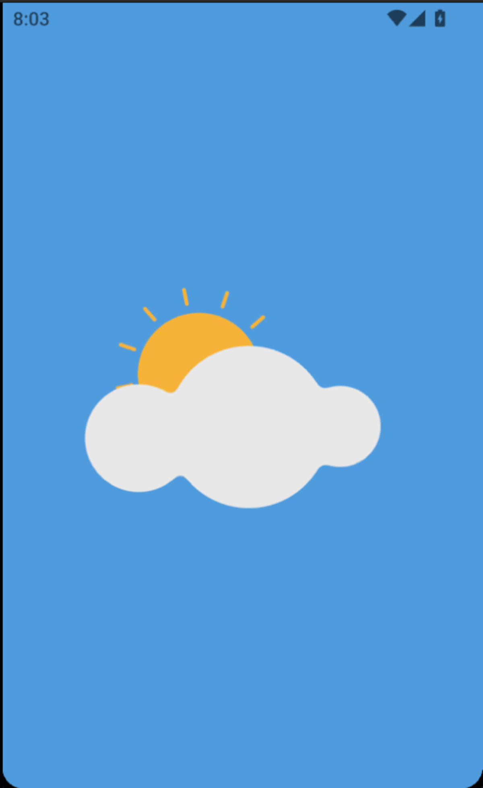

# Weather App

### Demo

[Watch Demo Video](https://drive.google.com/file/d/1vh7_6z8VyUhJWO57G__K4WCyGWwFqbT8/view?usp=sharing)

### Screenshots

<div align="center">
  
  
  
  
  <br/>
  
  
</div>

A Flutter weather app that shows current weather for any city — works offline, adapts to any screen size, and loads instantly from cache.

---

## User Scenarios

### 👋 First Launch (No Cache, No History)

```
  [Open app]
       │
       ▼
  ┌─────────────────────┐
  │  Splash animation   │
  │  plays (1 second)   │
  └──────────┬──────────┘
             │
             ▼
  ┌─────────────────────┐
  │  Home screen loads  │
  │  — empty, no data   │
  └──────────┬──────────┘
             │
             ▼
  ┌─────────────────────┐
  │  App checks cache   │
  │  → nothing found    │
  └──────────┬──────────┘
             │
             ▼
  ┌──────────────────────────────────┐
  │  App triggers location request   │
  │                                  │
  │  ┌──────────┐   ┌─────────────┐  │
  │  │ ALLOW    │   │   DENY      │  │
  │  └────┬─────┘   └──────┬──────┘  │
  │       │                │         │
  │       ▼                ▼         │
  │  Weather for        Falls        │
  │  your city          back to      │
  │  appears            Egypt        │
  └──────────────────────────────────┘
             │
             ▼
  ┌─────────────────────┐
  │  Skeleton shimmer   │
  │  while loading...   │
  └──────────┬──────────┘
             │
             ▼
  ┌─────────────────────┐
  │  Weather data       │
  │  slides in — temp,  │
  │  icon, condition,   │
  │  details card       │
  └─────────────────────┘
```

---

### 🔁 Returning User (Cache Exists)

```
  [Open app]
       │
       ▼
  ┌─────────────────────┐
  │  Splash animation   │
  └──────────┬──────────┘
             │
             ▼
  ┌────────────────────────────────────────────┐
  │  App reads last saved weather from Hive    │
  │  cache — this takes <10ms                  │
  └──────────┬─────────────────────────────────┘
             │
             ▼
  ┌────────────────────────────────────────────┐
  │  Weather data appears INSTANTLY            │
  │  — no loading, no shimmer, no API call     │
  │                                            │
  │  The app DOES NOT fetch from the internet  │
  │  on startup. Only user search triggers it. │
  └────────────────────────────────────────────┘
```

---

### 🔍 User Searches for a City

```
  [User types "London" in search bar]
       │
       ▼
  ┌─────────────────────┐
  │  User taps search   │
  │  icon or presses    │
  │  enter on keyboard  │
  └──────────┬──────────┘
             │
             ▼
  ┌──────────────────────────────────────┐
  │  Cubit checks internet connection    │
  │                                      │
  │  ┌─────────┐        ┌──────────┐     │
  │  │ ONLINE  │        │ OFFLINE  │     │
  │  └────┬────┘        └────┬─────┘     │
  │       │                  │           │
  │       ▼                  ▼           │
  │  Shimmer              Red snackbar   │
  │  replaces             "No internet   │
  │  current UI           connection"    │
  │       │              UI unchanged    │
  │       ▼                             │
  │  API call          ──►  DONE         │
  │  to weatherapi                        │
  │       │                              │
  │       ▼                              │
  │  New weather      Still shows        │
  │  data appears     previous / empty   │
  │  on screen        state              │
  │       │                              │
  │       ▼                              │
  │  Result saved                         │
  │  to Hive cache                        │
  │  for next launch                      │
  └──────────────────────────────────────┘
```

---

### ❌ User Searches for a Non-Existent City

```
  [User types "asdfgh" in search bar]
       │
       ▼
  ┌─────────────────────┐
  │  Online check → OK  │
  └──────────┬──────────┘
             │
             ▼
  ┌─────────────────────┐
  │  Shimmer appears    │
  └──────────┬──────────┘
             │
             ▼
  ┌──────────────────────────────────────────────┐
  │  WeatherAPI returns:                          │
  │  { "error": { "message": "No matching         │
  │    location found."} }                        │
  └──────────┬───────────────────────────────────┘
             │
             ▼
  ┌──────────────────────────────────────────────┐
  │  Error screen appears:                        │
  │  ┌─────────────────────────────────┐          │
  │  │  😞 Lottie animation            │          │
  │  │  "No matching location found."  │          │
  │  │  [Search bar at top]            │          │
  │  │  [Try again]                    │          │
  │  └─────────────────────────────────┘          │
  └──────────────────────────────────────────────┘
```

---

### 📡 User Goes Offline After Having Data

```
  [User has weather on screen → airplane mode]
       │
       ▼
  ┌──────────────────────────────────────────────┐
  │  Current weather stays on screen              │
  │  — nothing changes                           │
  └──────────────────────────────────────────────┘

  [User searches for a different city]
       │
       ▼
  ┌──────────────────────────────────────────────┐
  │  Red snackbar slides in from bottom:          │
  │  ┌──────────────────────────────────┐         │
  │  │  No internet connection          │         │
  │  └──────────────────────────────────┘         │
  │                                               │
  │  Screen still shows LAST city's weather       │
  │  — nothing changes, search is ignored         │
  └──────────────────────────────────────────────┘
```

---

### 🔌 API Goes Down But Cache Exists

```
  [User opens app — cache loads instantly]
       │
       ▼
  [User searches for "Cairo"]
       │
       ▼
  ┌──────────────────────────────────────────────┐
  │  Online check → ✅ OK                         │
  └──────────────────┬───────────────────────────┘
                     │
                     ▼
  ┌──────────────────────────────────────────────┐
  │  API call → ❌ Timeout / 500 error            │
  └──────────────────┬───────────────────────────┘
                     │
                     ▼
  ┌──────────────────────────────────────────────┐
  │  Repository finds stale cache                 │
  │  → Returns cached data as SUCCESS             │
  │                                               │
  │  App SHOWS the old weather silently           │
  │  No error message. No snackbar.               │
  │  User never knows the API failed.             │
  └──────────────────────────────────────────────┘
```

---

### 📱 Responsive Adaptation

```
  [User rotates phone, or moves from phone to tablet]

  ┌────── < 750px ──────┐
  │     MOBILE LAYOUT    │
  │  ┌────────────────┐  │
  │  │ Search bar     │  │
  │  ├────────────────┤  │
  │  │  🌤 32°        │  │
  │  │  Sunny         │  │
  │  │  Cairo         │  │
  │  ├────────────────┤  │
  │  │  Feels like 28° │  │
  │  │  Humidity 45%  │  │
  │  │  Wind 12 km/h  │  │
  │  └────────────────┘  │
  └──────────────────────┘

  ┌── 750 – 1200px ──────┐
  │     TABLET LAYOUT     │
  │  ┌──────────────────┐ │
  │  │  🌤 32°  Sunny   │ │
  │  │  Cairo           │ │
  │  │  Feels like 28°  │ │
  │  │  Humidity 45%    │ │
  │  │  Wind 12 km/h    │ │
  │  └──────────────────┘ │
  └───────────────────────┘

  ┌────── ≥ 1200px ───────────────┐
  │       DESKTOP LAYOUT           │
  │  ┌───────────────────────────┐ │
  │  │ 🌤 32°  Sunny  Cairo      │ │
  │  ├───────────────────────────┤ │
  │  │ Feels like: 28°           │ │
  │  │ Humidity:   45%           │ │
  │  │ Wind:       12 km/h       │ │
  │  │ UV Index:   5             │ │
  │  │ Pressure:   1015 hPa      │ │
  │  │ Visibility: 10 km         │ │
  │  │ Dew Point:  15°           │ │
  │  │ Cloud:      0%            │ │
  │  └───────────────────────────┘ │
  └────────────────────────────────┘
```

---

## Requirements Checklist

## Requirements Checklist

### ✅ All Required Features (Met)

| Feature | What It Does | Where |
|---|---|---|
| **City Search** | Text field + search button to look up any city | `search_text_field.dart` |
| **Weather Display** | Shows city name, temperature, condition text, and weather icon | `mobile_header_section.dart`, `tablet_header_section.dart`, `desktop_header_section.dart` |
| **Loading State** | Skeleton shimmer while fetching — no spinner, just a smooth placeholder | `home_mobile_view_body.dart` (via Skeletonizer) |
| **API Integration** | Connects to WeatherAPI.com with a configurable API key | `api_service.dart` + `.env` |
| **State Management** | BLoC pattern manages all state — weather data, location, and UI transitions | `weather_cubit.dart`, `location_cubit.dart` |
| **Error Handling** | Shows error messages for invalid cities and network failures | `weather_failed_content.dart`, `use_weather_effects.dart` |
| **Code Quality** | Clean Architecture (data / domain / presentation layers), dependency injection, atomic widgets | Full project structure |

### ✅ Bonus Features (Met)

| Feature | What It Does | Where |
|---|---|---|
| **Responsive Design** | Three separate layouts: mobile, tablet, desktop — auto-detected by screen width | `home_adaptive_layout.dart` + 3 view body files |
| **Offline Caching** | Saves last successful search to Hive (local database). Cache-first strategy: show cache immediately, refresh later | `weather_local_data_source.dart`, `weather_repository_impl.dart` |

---

## Architecture

```
┌────────────────────────────────────────────────────────────┐
│                    PRESENTATION LAYER                      │
│                                                            │
│  ┌──────────┐  ┌──────────┐  ┌──────────┐                 │
│  │  Mobile  │  │  Tablet  │  │ Desktop  │  3 responsive   │
│  │  View    │  │  View    │  │  View    │  layouts         │
│  └────┬─────┘  └────┬─────┘  └────┬─────┘                 │
│       └──────────────┼─────────────┘                       │
│                      ▼                                     │
│  ┌──────────────────────────────────────┐                  │
│  │         WeatherCubit                 │  Manages state   │
│  │         LocationCubit                │  and side effects│
│  └──────────────┬───────────────────────┘                  │
└─────────────────┼──────────────────────────────────────────┘
                  │
┌─────────────────┼──────────────────────────────────────────┐
│                 ▼                 DOMAIN LAYER              │
│  ┌──────────────────────────────────────┐                  │
│  │  GetWeatherUseCase                   │  Business logic  │
│  │  WeatherRepository (abstract)        │  contracts       │
│  └──────────────────┬───────────────────┘                  │
└─────────────────────┼──────────────────────────────────────┘
                      │
┌─────────────────────┼──────────────────────────────────────┐
│                     ▼               DATA LAYER              │
│  ┌────────────────────┐  ┌────────────────────┐            │
│  │  RemoteDataSource  │  │  LocalDataSource   │            │
│  │  (WeatherAPI.com)  │  │  (Hive — on disk)  │            │
│  └─────────┬──────────┘  └─────────┬──────────┘            │
│            │                       │                       │
│            ▼                       ▼                       │
│       InternetService          weather_cache              │
│       (connectivity)           (Hive box)                 │
└───────────────────────────────────────────────────────────┘
```

### Why This Architecture

- **Data Layer** talks to the outside world — the API and local storage.
- **Domain Layer** defines "what the app can do" — use cases and rules.
- **Presentation Layer** handles the UI and user interactions.

Each layer only talks to the layer below it. This keeps the code testable, swappable, and maintainable. Want to change the API? Only the data layer changes. Want to redesign the UI? Only presentation changes.

---

## Data Flow

```
USER TYPES CITY
       │
       ▼
SearchTextField calls weatherCubit.searchWeather(city)
       │
       ▼
WeatherCubit checks internet
       │
       ├── OFFLINE ──► ShowOfflineSnackbar effect → red snackbar → return
       │
       └── ONLINE ──► emit(WeatherLoading)
                       │
                       ▼
                GetWeatherUseCase.execute(city)
                       │
                       ▼
                WeatherRepositoryImpl.getWeather(city)
                       │
                       ├── Read cache first (always)
                       │
                       ├── Check internet
                       │
                       ├── ONLINE:
                       │    ├── Call API via RemoteDataSource
                       │    ├── Save result to LocalDataSource (Hive)
                       │    └── Return fresh data
                       │
                       └── OFFLINE / API ERROR:
                            ├── Have cache? → Return cached (stale) data
                            └── No cache?  → Return Failure
                       │
                       ▼
                result.fold(
                  failure → emit(WeatherFailed) + ShowFailureSnackbar
                  data    → emit(WeatherSuccess)
                )
```

---

## Caching Strategy (Offline-First)

| Scenario | Behavior |
|---|---|
| **App start, cache exists** | Show cached data instantly. No API call. |
| **App start, no cache** | Trigger location search → fetch from API. |
| **User searches online** | Fetch from API, save to cache, show fresh data. |
| **User searches offline** | Show snackbar "No internet". Don't change current UI. |
| **API fails, cache exists** | Return cached data silently (stale is better than error). |
| **API fails, no cache** | Show error screen. |

---

## Project Structure

```
lib/
├── app.dart                          # App entry — MaterialApp.router + DevicePreview
├── main.dart                         # Initialization — Hive, dotenv, service locator
│
├── core/                             # Shared across all features
│   ├── constants/                    # App strings, Lottie asset paths
│   ├── di/                           # Service locator (get_it)
│   ├── error/                        # Failure types, API exception
│   ├── extensions/                   # Theme helpers, location formatters
│   ├── helpers/                      # Snackbar, status bar
│   ├── routes/                       # GoRouter config
│   ├── services/                     # ApiService, InternetService, LocationService
│   ├── theme/                        # Colors, themes
│   ├── typography/                   # Responsive font sizing
│   └── widgets/                      # Shared UI — error widget, loading spinner, keyboard dismisser
│
├── features/
│   ├── splash/                       # Animated Lottie splash → auto-navigate
│   └── home/                         # Main weather feature
│       ├── data/                     # API calls, Hive storage, repository implementation
│       ├── domain/                   # Weather entity, repository interface, use case
│       └── presentation/
│           ├── controller/           # WeatherCubit + LocationCubit + states + effects
│           ├── hooks/                # useWeatherEffects — snackbar subscription
│           └── view/
│               ├── widgets/          #
│               │   ├── desktop/      # Desktop-specific weather content
│               │   ├── mobile/       # Mobile-specific content
│               │   ├── tablet/       # Tablet-specific content
│               │   ├── search_text_field.dart
│               │   ├── location_button.dart
│               │   ├── weather_failed_content.dart
│               │   ├── details_card_info.dart
│               │   └── home_adaptive_layout.dart
│               ├── home_view.dart
│               ├── home_mobile_view_body.dart
│               ├── home_tablet_view_body.dart
│               └── home_desktop_view_body.dart
```

---

## Responsive Breakpoints

| Screen Width | Layout | Key Differences |
|---|---|---|
| < 750px | **Mobile** | Single-column, bottom-aligned, compact details card |
| 750 – 1200px | **Tablet** | Centered, wider padding, same core widgets |
| ≥ 1200px | **Desktop** | Air conditions section (8 metrics), sliver layout, wider spacing |

---

## Tech Stack

| Package | Purpose |
|---|---|
| **flutter_bloc** | State management (BLoC pattern) |
| **dio** | HTTP client for API calls |
| **hive_ce** | Local caching (Hive Community Edition) |
| **get_it** | Dependency injection |
| **go_router** | Declarative routing |
| **geolocator** | Device location |
| **internet_connection_checker_plus** | Internet connectivity check |
| **flutter_screenutil** | Responsive screen sizing |
| **skeletonizer** | Shimmer loading placeholders |
| **flutter_hooks** | Hook-based lifecycle |
| **lottie** | Animations (splash, error) |
| **cached_network_image** | Weather icon caching |
| **flutter_dotenv** | Environment variables (API key) |

---

## Setup

1. Clone the repo.
2. Add your WeatherAPI key to `.env`:
   ```
   API_BASE_URL=https://api.weatherapi.com/v1
   API_KEY=your_key_here
   ```
3. Run `flutter pub get`.
4. Run `flutter run`.

---

## What It Looks Like

| Mobile | Tablet | Desktop |
|---|---|---|
| City + temp + icon | Centered layout | Full-width with air conditions panel |
| Details card below | Details card to side | Sliver scrolling |
| Search bar at top | Same header structure | Gradient background |
